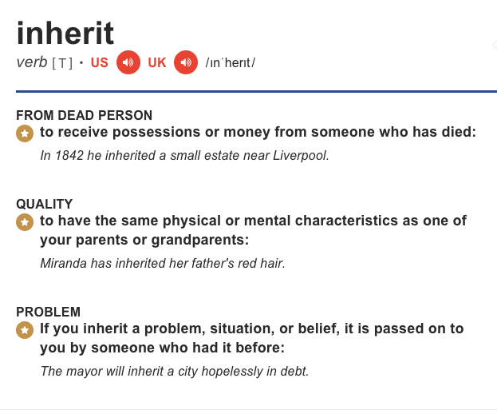
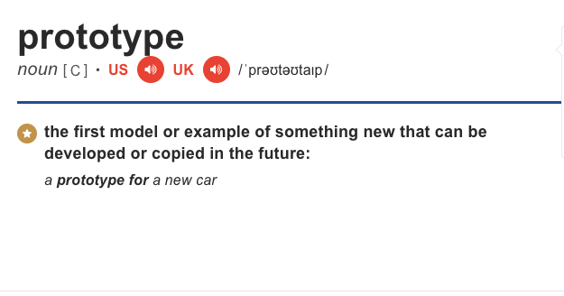
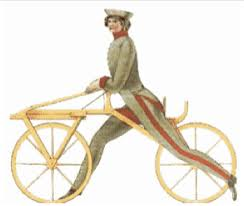
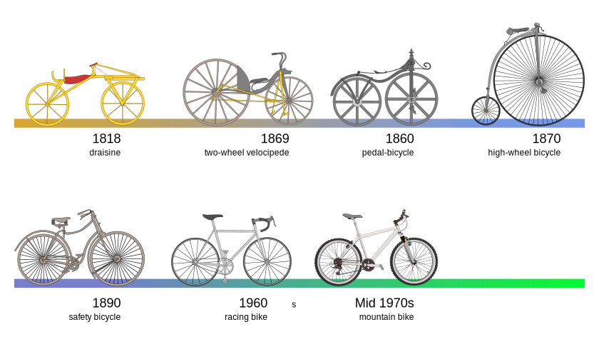

# Class, Constructors, and Prototypal Inheritance

### Learning Objectives
- Define a custom constructor method that sets one or more properties of a new object
- Use namespaces to organize application code
- Demonstrate a use case that explains prototypal inheritance and what kind of flexibility it gives to programmers

Consider we own a bike shop and we're building a website. We need to represent our inventory as objects to be displayed online.

We _could_ define an object for each bike in the shop...

```javascript
let bike1 = {
  type: 'road',
  color: 'red',
  wheels: 2,
	roll: function() {
    console.log('they see me rollin...')
  }
}

let bike2 = {
  type: 'mountain',
  color: 'blue',
  wheels: 2,
	roll: function() {
    console.log('they see me rollin...')
  }
}
```
...but _should_ we?
What's the problem with this strategy?

### Introducing Class 

Classes help us define new objects with less repetition. They serve as blueprints that give form to new objects. Class declarations contain a method called a constructor which is called automatically when the 'new' keyword is used. Constructor methods may take arguments which are translated to properties of new objects.
- conventionally, class names start with a capital letter
- classes contain a constructor method which creates instances of the class
- a class can be instantiated with the 'new' keyword

First we define our Class.
#### sugar
```javascript
class Bike {
  constructor (type, color) {
    this.type = type
    this.color = color
    this.wheels = 2
  }

  roll () {
    console.log('they see me rollin...')
  }
}
```
Then, we create instances of our class.
```javascript
let bike1 = new Bike('road', 'red')
let bike2 = new Bike('mountain', 'blue')
```

Classes in JavaScript are syntactic sugar. They allow us to package the constructor and the methods to be used by new objects in one place. The code below achieves the same effect without using the 'class' keyword.

#### desugar
```javascript
//constructor function
function Bike (type, color) {
  this.type = type
  this.color = color
  this.wheels = 2
} 
//function to give a method to instances of Bike
Bike.prototype.roll = function () {
  console.log('they see me rollin...')
  }
```

Classes help solve our repetition problem. We created one class which can be reused to create any number of bikes without hard-coding individual objects.

... but we have another problem. A bike can't be fully described with a type and color alone. We probably want to include information about the brand, model, frame size, wheel size, ect.. Perhaps different types of bikes have different functions. You wouldn't use a road bike, off-road, and you wouldn't commute to work on a bmx bike.

__Objects can become large and complex__.

Prototypal inheritance helps us manage complexity.

### What is prototypal inheritance?
...
#### What is inheritance?


#### What is a prototype?



#### Prototyping in product design: an analogy
##### Build
Prototyping is an important part of all design. It's a process that allows for incremental testing and improvement of a product. Consider the example of designing a bicycle. First you must develop a prototype, a working model to showcase your design. You start simple knowing you can revise your product later. You invest enough time and money to build your model, a prototype to showcase your idea.



##### Test
So you test your prototype, you ask for opinions from others. Everyone loves the design except but they have some suggestions for improving it. So what do you do? 

##### Repeat
Naturally you need to create another model, hopefully a better one. Do you start from scratch? Of course not! You reference everything you learning building your first model and you modify it. You keep the parts that are good and improve or replace the parts that aren't. This model becomes the new prototype and the cycle continues. Each new model takes qualities from the previous model and builds off them. In other words, __a new model inherits from its prototype__. 



We don't have to reinvent the wheel every time we create a new bicycle. We can save time and energy focusing on what is specifically new or different rather than repeating the design process from the very beginning. __Prototypal inheritance allows us to build incrementally__.

### Prototypal Inheritance in JavaScript

The concept of a prototype is critical to understanding inheritance in JavaScript and it allows us the same benefits seen in product design.

Building large objects incrementally using inheritance:
- prevents unnecessary repetition
- saves time
- helps organize code into simple parts

Returning to the bike shop example, lets build more complicated objects using inheritance.

#### sugar
First we create a parent class. One that will be true for all bikes in our shop.
```javascript
class Bike {
  //the constructor creates instances of Bike which will all have 2 wheels
  constructor () {
    this.wheels = 2
  }
  //all instances of Bike will have access to the roll method
  roll () {
    console.log('they see me rollin...')
  }
}
```

Great! Our first class is simple and will hold true for all bikes. We can create an instance of this class with the 'new' keyword. 

```javascript
let anyBike = new Bike()
//Bike takes no arguments because Bike's constructor method has no parameters.
```

Next, we create another _simple_ class, a subclass that will inherit from Bike. Together they can create objects that are more complicated than either can alone.

```javascript
class BikeType extends Bike {
  constructor(type, brand) {
    super()
    this.type = type
    this.brand = brand
  }
}
```

Our subclass has two key differences. It uses the keyword 'extends' to inherit methods from Bike. To inherit the parent class' properties we use the super function. Super calls the parent class' constructor method inside of the subclass' constructor.

Again, we can create an instance of our subclass with 'new'.

```javascript
trekRoadBike = new BikeType('road', 'Trek')
//this time we pass an argument to TrekBike because TrekBike's constructor has a type parameter.
```

Now we can create bikes with any combination of type and brand.
Plus, they all still have two wheels and can roll.

We can continue to incrementally add complexity to our objects by creating additional subclasses. Perhaps we have several mountain bikes made by Giant but they are varied in size and color.

First, create a class that inherits from BikeType.

```javascript
class GiantMtnBike extends BikeType {
  constructor(frameSize, color) {
    super('mountain', 'Giant')
    this.frameSize = frameSize
    this.color = color
    }
  goOffroad () {
    console.log('bump bump bump bump') 
  }
}
//Notice that super now takes two arguments to specify that all objects created with this subclass will be mountain bikes made by Giant.
```

Lets create an instance of GiantMtnBike to demonstrate that we have access to attributes and methods from both the BikeType and Bike classes.

```javascript
bigBlueGiant = new GiantMtnBike('58cm', 'blue')
```

Creating objects using prototypal inheritance allows us to focus on small and simple steps, working from a broad parent class to more specific subclasses. We can target methods to objects which need them without bloating others with unnecessary and potentially harmful code. This process gives us flexibility in creating complex objects using simple code while preventing repetition and unexpected errors.

#### desugar

```javascript
//parent class constructor function
function Bike () {
  this.wheels = 2
}
//add a Bike method
Bike.prototype.roll = function () {
  console.log('they see me rollin...')
}

//instantiate a new Bike
let anyBike = new Bike()

//BikeType subclass constructor function
function BikeType (type, brand) {
  Bike.call(this) //inherits attributes from Bike
  this.type = type
  this.brand = brand
  }

//BikeType inherits methods from Bike
BikeType.prototype = Object.create(Bike.prototype)

//instantiate a new BikeType
trekRoadBike = new BikeType('road', 'Trek')

//GiantMtnBike subclass constructor function
function GiantMtnBike (frameSize, color) {
  BikeType.call(this, 'road', 'Trek') //inherits attributes from BikeType
  this.frameSize = frameSize
  this.color = color
}

//GiantMtnBike inherits methods from BikeType
GiantMtnBike.prototype = Object.create(BikeType.prototype)

//add a GiantMtnBike method
GiantMtnBike.prototype.goOffroad = function () {
  console.log('bumb bump bump bump')
}

//instantiate a new GiantMtnBike
trekRoadBike = new BikeType('road', 'Trek')

```


