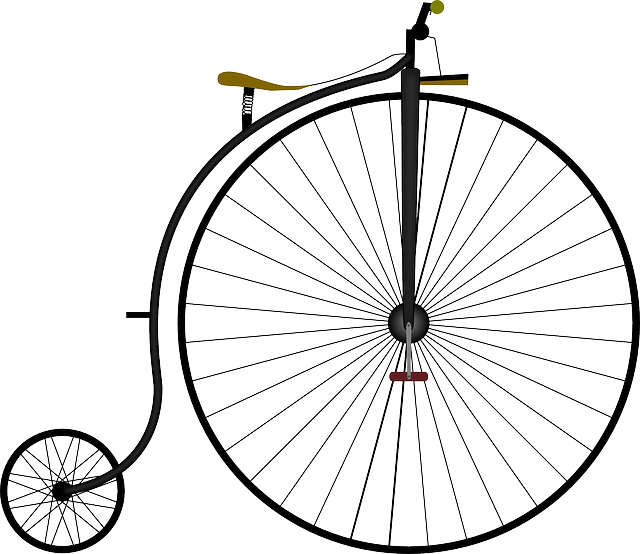

# Class, Constructors, and Prototypal Inheritance

### Learning Objectives
- Define a custom constructor method that sets one or more properties of a new object
- Use namespaces to organize application code
- Demonstrate a use case that explains prototypal inheritance and what kind of flexibility it gives to programmers

Consider we own a bike shop and we're building a website. We need to represent our inventory as objects to be displayed online.

We _could_ define an object for each bike in the shop...

```javascript
let bike1 = {
  type: 'road',
  color: 'red',
  wheels: 2,
	roll: function() {
    console.log('they see me rollin...')
  }
}

let bike2 = {
  type: 'mountain',
  color: 'blue',
  wheels: 2,
	roll: function() {
    console.log('they see me rollin...')
  }
}
```
...but _should_ we?
What's the problem with this strategy?

### Introducing Class 

Classes help us define new objects with less repetition. Classes in JavaScript are syntactic sugar. They allow us to package the constructor (a method needed to create new objects) and the methods to be used by the new objects in one place.
- conventionally, class names start with a capital letter
- a class can be instantiated with the 'new' keyword

Classes serve as blueprints that give form to new objects. Class declarations contain a method called a constructor which is called automatically with the 'new' keyword. Constructor methods may take arguments which are translated to properties of the new object.


First we define our Class.
##### sugar
```javascript
class Bike {
  constructor (type, color) {
    this.type = type
    this.color = color
    this.wheels = 2
  }

  roll () {
    console.log('they see me rollin...')
  }
}
```

##### desugar
```javascript
function Bike (type, color) {
  this.type = type
  this.color = color
  this.wheels = 2
} 

Bike.prototype.roll = function () {
    console.log('they see me rollin...')
  }
```

Then, we create instances of our class.
```javascript
let bike1 = new Bike('road', 'red')
let bike2 = new Bike('mountain', 'blue')
```

Classes help solve our repetition problem. We created one class which can be reused to create any number of bikes without hard-coding individual objects.

... but we have another problem. A bike can't be fully described with a type and color alone. We probably want to include information about the brand, model, frame size, wheel size, ect.. Perhaps different types of bikes have different functions. You wouldn't use a road bike, off-road, and you wouldn't commute to work on a bmx bike.

__Objects can become large and complex__.

Prototypal inheritance helps us manage complexity.

### What is prototypal inheritance?
...
#### What is inheritance?


#### What is a prototype?


#### Prototyping in product design: an analogy
##### Build
Prototyping is an important part of all design. It's a process that allows for incremental testing and improvement of a product. Consider the example of designing a bicycle. First you must develop a prototype, a working model to showcase your design. You start simple knowing you can revise your product later. You invest enough time and money to build your model, a prototype to showcase your idea.



##### Test
So you test your prototype, you ask for opinions from others. Everyone loves the design except but they have some suggestions for improving it. So what do you do? 

##### Repeat
Naturally you need to create another model, hopefully a better one. Do you start from scratch? Of course not! You reference everything you learning building your first model and you modify it. You keep the parts that are good and improve or replace the parts that aren't. This model becomes the new prototype and the cycle continues. Each new model takes qualities from the previous model and builds off them. In other words, __a new model inherits from its prototype__. 


We don't have to reinvent the wheel every time we create a new bicycle. We can save time and energy focusing on what is specifically new or different rather than repeating the design process from the very beginning. __Prototypal inheritance allows us to build incrementally__.

### Prototypal Inheritance in JavaScript

The concept of a prototype is critical to understanding inheritance in JavaScript and it allows us the same benefits seen in product design.
- prevents unnecessary repetition
- saves time
- helps organize code into smaller pieces


function Bike () {
	this.wheels = 2
	this.roll = function () {
		console.log('they see me rollin...')
    }
}

anyBike = new Bike ()

function MountainBike () {
	this.hasSuspension = true
	this.offRoad = function () {
		console.log('bump bump bump bump')
    }
}

MountainBike.prototype = new Bike()

function TrekMtnBike (frameSize, color) {
	this.frameSize = frameSize
	this.color = color
	this.brand = 'Trek'
}

TrekMtnBike.prototype = new MountainBike()

largeBlueTrek = new TrekMtnBike('58cm', 'blue')


/////////////////////
function Bike () {
    this.wheels = 2
	this.roll = function () {
		console.log('they see me rollin...')
    }
}

function TrekBike (type) {
	this.type = type
	this.brand = 'Trek'
}

TrekBike.prototype = new Bike()

function TrekRoadBike (frameSize, color) {
	this.frameSize = frameSize
	this.color = color
	this.sayBrand = function () {
		console.log('I was made by ' + this.brand)
    }
}

TrekRoadBike.prototype = new TrekBike('road')

let myBike = new TrekRoadBike('56cm', 'black')


____________________
class, new, super keywords
```javascript
class Bike {
	constructor() {
		this.wheels = 2
    }

	roll () {
		console.log('they see me rollin...')
    }
}

class TrekBike extends Bike {
	constructor(type) {
		super()
		this.type = type
		this.brand = 'Trek'
    }
}

class TrekRoadBike extends TrekBike {
	constructor(frameSize, color) {
		super('road')
		this.frameSize = frameSize
		this.color = color
    }
	sayBrand () {
		console.log('I was made by ' + this.brand) 
    }
}
```

_________________
prototypical inheritance 
```javascript
function Bike () {
    this.wheels = 2
}
Bike.prototype.roll = function () {
	console.log('they see me rollin...')
}

function TrekBike (type) {
  Bike.call(this)
	this.type = type
	this.brand = 'Trek'
}

TrekBike.prototype = Object.create(Bike.prototype)

function TrekRoadBike (frameSize, color) {
	TrekBike.call(this, 'road')
	this.frameSize = frameSize
	this.color = color
}
TrekRoadBike.prototype = Object.create(TrekBike.prototype)

TrekRoadBike.prototype.sayBrand = function () {
	console.log('I was made by ' + this.brand)
}